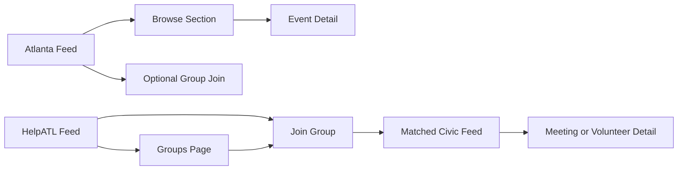

# HelpATL vs Atlanta Wireframe Spec 001

- Date: 2026-03-07
- Scope: side-by-side consumer IA and key screen blocks
- Goal: make platform diversity visible with shared architecture underneath

## Shared Architecture, Different Priorities

Both portals keep:
1. Header
2. Feed shell
3. Section blocks
4. Groups/follow capability
5. Event detail destination

Difference is block priority and language, not platform capability availability.

## Screen 1: Feed (Top Fold)

### Atlanta (Discovery-first)

1. Header: broad city nav (`Dashboard`, `Stuff`, `Places`)
2. Hero: editorial headline + city pulse framing
3. Quick links: flexible city exploration
4. Section entry: trending/featured lanes

### HelpATL (Action-first)

1. Header: civic nav (`Act`, `Calendar`, `Groups`)
2. Hero: "Your Civic Week in Atlanta"
3. Action rail: `Join Groups`, `Volunteer Now`, `Track School Board`
4. Groups strip: joined channels and quick manage action

## Screen 2: Mid Feed Structure

### Atlanta

1. Multi-lane discovery sections
2. Variety over sequence strictness
3. Civic sections present but non-dominant

### HelpATL

1. Government Meetings
2. Volunteer Opportunities
3. School Board Watch
4. Reason/source context prioritized in card metadata

## Screen 3: Groups Page

### Atlanta (optional utility)

1. Generic groups browsing
2. Fewer mandatory civic presets

### HelpATL (core workflow)

1. Preset row: `City + County`, `School Board`, `Volunteer`
2. Type row: `Jurisdiction`, `Institution`, `Topic`
3. Joined-first sorting
4. Clear `Join`/`Joined` actions

## Flow Comparison

## Capability Callouts By Screen

1. Feed hero: portal-specific voice + IA intent.
2. Group strip: interest channel capability surfaced as product, not hidden feature.
3. Section stack: same section engine, different semantic ordering.
4. Card metadata: explainability layer (`Matched`, `Source`, freshness) in HelpATL.

## Implementation Targets

1. Feed shell and hero:
   - `web/components/feed/CityPulseShell.tsx`
   - `web/components/feed/GreetingBar.tsx`
2. Groups in feed:
   - `web/components/feed/sections/InterestChannelsSection.tsx`
3. Groups page:
   - `web/app/[portal]/groups/page.tsx`
   - `web/components/channels/PortalGroupsClient.tsx`
4. Reason labels:
   - `web/components/ReasonBadge.tsx`

## Design Review Checklist

1. Can a user infer each portal's purpose from the first screen?
2. Does HelpATL prioritize action over exploration?
3. Does Atlanta preserve broad city-discovery identity?
4. Are shared primitives obvious to internal stakeholders despite visual/IA differences?
