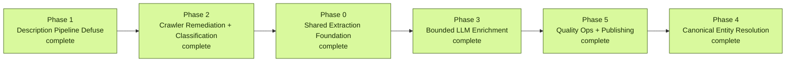

# Rich Data Program Board

**Date:** 2026-04-01  
**Status:** Active control board  
**Scope:** `both`  
**Primary roadmap:** `docs/superpowers/plans/2026-03-30-rich-data-roadmap.md`

This is the top-level tracking board for the rich data program.

## Control Model

- This board is the only top-level status surface for the rich data effort.
- `docs/superpowers/plans/2026-03-31-rich-data-roadmap-continuation-workstream.md` is the only active execution workstream.
- `docs/superpowers/plans/2026-03-30-rich-data-roadmap.md` is strategy/reference only.
- Phase workstream docs are historical audit/reference docs unless this board explicitly reopens one.
- Agents must not create new active plan surfaces for this effort unless this board promotes them.

## Status Legend

| Status | Meaning |
|---|---|
| `queued` | defined but not being executed |
| `active` | currently being worked |
| `late-stage` | still active, but mostly finishing and validating |
| `blocked` | cannot proceed without clearing a concrete blocker |
| `complete` | exit criteria met |

## Visual Tracker

## Phase Board

| Phase | Status | Progress | What “done” means | Canonical doc |
|---|---|---:|---|---|
| Phase 1. Description Pipeline Defuse | `complete` | 100% | synthetic description writes are defused and cleanup no longer re-pollutes | `docs/superpowers/plans/2026-03-30-phase1-description-pipeline-workstream.md` |
| Phase 2. High-Impact Crawler Remediation | `complete` | 100% | production rewrite queue is closed, high-noise sources are validated, and the docs match live state | `docs/superpowers/plans/2026-03-30-phase2-crawler-remediation-workstream.md` |
| Phase 0. Shared Extraction Foundation | `complete` | 100% | shared helper families are landed across the repeated crawler families, the provenance/write-contract audit is closed, and remaining exceptions are non-blocking source-state validation issues | `docs/superpowers/plans/2026-03-30-rich-data-roadmap.md` |
| Phase 3. Bounded LLM Enrichment | `complete` | 100% | the bounded pilot control set (`roswell-roots-festival`, `georgia-educational-technology-conference`, `west-end-comedy-fest`) now completes prepare -> extract -> dry-run apply cleanly without broadening beyond festivals | `docs/superpowers/plans/2026-03-30-phase3-bounded-llm-enrichment-workstream.md` |
| Phase 5. Quality Ops + Publishing | `complete` | 100% | the festival report/gate stayed `PASS` across two clean cycles, the remediation queue remained empty, and the Atlanta-facing verification loop now passes against live data | `docs/superpowers/plans/2026-03-30-phase5-quality-ops-publishing-workstream.md` |
| Phase 4. Canonical Entity Resolution | `complete` | 100% | the low-risk venue tranche is landed, yearly-wrapper fragmentation is cleared, organizer duplication remains negligible, the program/session tail is explicitly bounded, and the entity gate now reports `BOUNDED_QUEUE` instead of an open mutation backlog | `docs/superpowers/plans/2026-03-30-phase4-canonical-entity-resolution-workstream.md` |

## Sub-Initiative Board

### Phase 2

| Initiative | Status | Progress | Current gate | Next move |
|---|---|---:|---|---|
| Wave 1 crawler remediation | `complete` | 100% | none | closed |
| Wave 2 crawler remediation | `complete` | 100% | none | closed |
| `is_show` rollout + API adoption | `complete` | 100% | none | monitor only |
| Shared classification hardening | `complete` | 100% | no gating live classifier drift remains in the Phase 2 queues | closed |
| Library/community production rewrite tranche | `complete` | 100% | none | closed |
| Music/Nightlife false-negative cleanup tranche | `complete` | 100% | none | closed |
| Phase 2 docs reconciliation | `complete` | 100% | docs match the live production record | closed |

### Phase 0

| Initiative | Status | Progress | Current gate | Next move |
|---|---|---:|---|---|
| Shared description/content-region helpers | `complete` | 100% | none | closed |
| Shared provenance/confidence contract audit | `complete` | 100% | persisted extraction metadata still routes through the existing `detail_enrich` and `event_extractions` path; helper families did not introduce schema drift | closed |
| First 3 crawler migrations | `complete` | 100% | none | closed |

### Phase 3

| Initiative | Status | Progress | Current gate | Next move |
|---|---|---:|---|---|
| Festival-only workflow narrowing | `complete` | 100% | the bounded pilot control set now closes cleanly across Roswell Roots, GaETC, and West End without broadening beyond festivals | closed |
| Grounding + junk gates | `complete` | 100% | the current apply gate now survives noisy site chrome, conference-style marketing copy, and schedule-heavy festival pages without loosening grounding rules | closed |
| First end-to-end festival dry-run | `complete` | 100% | the bounded pilot control set now has three accepted dry-runs | closed |

### Phase 5

| Initiative | Status | Progress | Current gate | Next move |
|---|---|---:|---|---|
| Source quality report | `complete` | 100% | the report, gate, and remediation manifest stayed aligned through two clean cycles with an empty remediation queue | monitor only |
| Promotion gates for high-noise sources | `complete` | 100% | the explicit held-source tranche is closed, the structural remediation queue is empty, and the machine gate is now `PASS` | monitor only; the residual pending-only rows are historical past-cycle demotions, not active work |
| Atlanta-facing verification loop | `complete` | 100% | `crawlers/reports/festival_atlanta_verification_latest.md` now verifies the Atlanta-facing festival lane at `PASS` with zero in-scope missing announced starts or remediation queue | monitor only |

### Phase 4

| Initiative | Status | Progress | Current gate | Next move |
|---|---|---:|---|---|
| Venue alias/resolution audit | `complete` | 100% | the low-risk merge tranche landed (`Atlanta Symphony Hall` → `Symphony Hall`, `The Painted Pin` → `Painted Pin`); the remaining top venue families are correctly classified as `manual_review_only` because they share domains but not addresses | monitor only; do not reopen low-risk auto-merge work without new address evidence |
| Festival entity vs occurrence separation | `complete` | 100% | yearly-wrapper fragmentation is now `0.0%` and the safe wrapper cleanup tranche is closed | monitor only |
| Program/session/organizer linking | `complete` | 100% | the entity gate now reports `BOUNDED_QUEUE`; program/session fragmentation is down to a bounded matching-only residual (`2.4%`) and organizer duplication remains `0.0%` after verify-only recheck | monitor only; leave the residual matching-only queue explicit but non-blocking |

## Active Now

| Track | Status | Notes |
|---|---|---|
| Phase 4 mutation waves | `complete` | the bounded venue tranche is landed, the yearly-wrapper queue is cleared, organizer duplication remains negligible, and the residual program/session queue is now explicitly bounded under the `BOUNDED_QUEUE` gate |
| Post-Phase-4 venue-description monitoring | `active` | nine bounded live cycles are now landed: cycles 1-7 remain accepted as logged, cycle 8 accepted `The Royal Peacock` with fetch/grounding misses classified, and cycle 9 accepted `Actor's Express` and `SK8 the Roof` with skips/rejections classified; the report/gate remain stable at `PILOT_READY`, the healthy description rate is now `89.2%`, and the lane is now a monitored bounded loop rather than a broad remediation program |
| Phase 3 bounded festival pilot | `complete` | the control set now closes cleanly across Roswell Roots, GaETC, and West End after anchoring schedule-heavy pages with grounded current festival copy |
| Phase 5 festival quality ops | `complete` | the report, gate, remediation manifest, and Atlanta verification loop all stayed clean through the closeout cycle |
| Program-level tracking | `active` | this board is the control surface for phase and sub-initiative status |

## Current Blockers

| Blocker | Scope | Impact | Resolution path |
|---|---|---|---|
| None at the program-board level | steady-state monitoring | the current residual queues are bounded, not blocked; venue auto-merges are intentionally stopped at the low-risk boundary and the remaining program fragmentation is a small matching-only cleanup tail | continue monitoring unless the entity gate regresses, the venue lane surfaces a new gating defect, or a portal-visible merge mistake is found |

## Historical Exceptions

These do not block the active phase and remain recorded only so agents do not rediscover them:

| Exception | Former scope | Notes |
|---|---|---|
| MJCCA AJAX endpoint `429 Too Many Requests` | Phase 0 active-source validation | source-side throttle, not a helper regression |
| `cobb-adult-swim-lessons` inactive in `sources` | Phase 0 active-source validation | inactive-source validation exception |
| `gwinnett-basic-meditation` inactive in `sources` | Phase 0 active-source validation | inactive-source validation exception |
| DeKalb ACTIVENet `502 Server Hangup` for `dekalb-tobie-grant-pickleball` | Phase 0 active-source validation | source outage during validation, not a helper regression |
| `west-end-comedy-fest` fetch stalls / connection-reset path | Phase 3 bounded festival dry-run selection | historical resolved edge; the bounded pilot now completes cleanly after task prep started carrying grounded current festival copy on schedule-heavy pages |

## Next Up

1. Keep the venue-description lane bounded and source-grounded: continue only through explicit rich-copy tranches while leaving thin cinema/storefront pages and known low-signal domains in the explicit `monitor_only` queue.
2. Keep the residual venue duplicate families (`Lore`, `Atlanta BeltLine`, `Metropolitan Studios`, and similar same-domain / different-address cases) classified as `manual_review_only`; do not reopen low-risk auto-merge work unless new address evidence emerges.
3. Keep the residual Phase 4 matching-only program tail explicit (`2.4%` program/session fragmentation under `BOUNDED_QUEUE`), but treat it as monitoring follow-up rather than active roadmap work.

## Update Rules For Agents

When an agent materially changes this program:

1. Update the `Phase Board` row if phase status or progress changed.
2. Update the affected `Sub-Initiative Board` row.
3. Update `Active Now`, `Current Blockers`, `Historical Exceptions`, or `Next Up` if sequencing changed.
4. Put tranche-level narrative and verification in the master execution workstream, not here.
5. Do not create new active execution docs unless this board explicitly promotes them.

## Last Updated Snapshot

- Phase 1 is complete.
- Phase 2 is complete.
- Phase 0 is complete.
- Phase 3 is complete.
- Phase 5 is complete.
- The only active execution surface is `docs/superpowers/plans/2026-03-31-rich-data-roadmap-continuation-workstream.md`.
- The current active queue is:
  - the bounded festival pilot control set now completes cleanly across:
    - `roswell-roots-festival`
    - `georgia-educational-technology-conference`
    - `west-end-comedy-fest`
  - live task prep now carries grounded current festival copy into schedule-heavy pages instead of feeding the LLM only lineup text
  - `crawlers/reports/festival_quality_report_latest.md` currently reports overall festival state as `PASS`
  - `crawlers/reports/festival_promotion_gate_latest.json` currently returns `PASS` with `0` explicit promotion holds
  - `crawlers/reports/festival_remediation_manifest_latest.md` remains empty as the monitoring artifact
  - `crawlers/reports/festival_atlanta_verification_latest.md` currently returns `PASS` for the Atlanta-facing verification loop
  - `crawlers/reports/entity_resolution_report_latest.md` now reflects live mutation progress:
    - duplicate place rate: `1.2%`
    - unresolved place/source match rate: `0.4%`
    - festival yearly-wrapper fragmentation rate: `0.0%`
    - program/session fragmentation rate: `2.4%`
    - organizer duplication rate: `0.0%`
  - `crawlers/reports/entity_resolution_gate_latest.json` now returns `BOUNDED_QUEUE`; the issue labels are complete and the residual queue is explicitly bounded
  - the first bounded Phase 4 mutation waves are materially landed:
    - Wave A low-risk venue merges:
      - `Atlanta Symphony Hall` → `Symphony Hall`
      - `The Painted Pin` → `Painted Pin`
    - Wave A then stopped at the safe boundary:
      - `Lore` / `Lore Atlanta`
      - `Atlanta BeltLine` / `Atlanta BeltLine Center`
      - similar same-domain / different-address venue families
      - those now classify as `manual_review_only`, not `alias_support_fix`
    - Wave B yearly-wrapper cleanup:
      - `Anime Weekend Atlanta 2026`
      - `BronzeLens Film Festival 2026`
      - `Dragon Con 2026`
      - `Juneteenth Atlanta Parade & Music Festival 2026`
      - yearly-wrapper fragmentation is now `0.0%`
    - Wave C program/session repair:
      - exact-duplicate and family-key repair swept the active `atlanta-families` portal program set
      - live backfill summary:
        - `32` active sources scanned
        - `19` sources changed
        - `1250` family-key backfills
        - `43` exact duplicate deletes
      - a follow-up residual tranche then repaired legacy `atlanta` / `piedmont` rows for:
        - `cobb-parks-rec`
        - `gwinnett-parks-rec`
        - `piedmont-classes`
      - that tranche added:
        - `1125` more family-key backfills
        - `66` more exact duplicate deletes
      - program/session fragmentation fell from `39.4%` into a bounded residual queue now measured at `2.4%`
    - Wave D organizer linking remains verify-only:
      - organizer duplication remains `0.0%`
      - no organizer mutation tranche is currently justified
  - the first post-roadmap venue-description lane is now live, not just queued:
    - `crawlers/reports/venue_description_report_latest.md`
    - `crawlers/reports/venue_description_gate_latest.json`
    - nine bounded live cycles landed:
      - cycle 1 accepted and wrote:
        - `Best Friend Park Pool`
        - `Cemetery Field`
        - `DeShong Park`
      - cycle 1 correctly skipped thin/noisy sites:
        - `Look Cinemas`
        - `The Springs Cinema & Taphouse`
      - cycle 2 accepted and wrote:
        - `Core Dance Studios`
        - `Gordon Biersch Brewery Restaurant`
        - `Marietta Theatre Company`
        - `Urban Grind`
        - `Vas Kouzina`
      - cycle 3 accepted and wrote:
        - `Ameris Bank Amphitheatre`
        - `Lyndon House Arts Center`
        - `Mary Schmidt Campbell Center for Innovation and the Arts`
        - `Pinch 'n' Ouch Theatre`
        - `Spelman College Museum of Fine Art`
      - cycle 3 correctly rejected weakly grounded outputs for:
        - `Level Up Gaming Lounge`
        - `Selig Family Black Box Theatre`
        - `The Flatiron`
      - cycle 4 accepted and wrote:
        - `Atlanta Ballet Centre - Michael C. Carlos Dance Centre`
        - `Auburn Avenue Research Library`
        - `The Ivy Bookshop at Ponce City Market`
        - `Kimchi Red - Alpharetta`
        - `Mary Schmidt Campbell Center for Innovation and the Arts, Bank of America Gallery`
      - cycle 5 accepted and wrote:
        - `Gas South Arena`
        - `Gateway Center Arena`
        - `Silverbacks Park`
        - `Waffle House Museum`
        - `World of Coca-Cola`
      - cycle 6 accepted and wrote:
        - `Giga-Bites Cafe`
        - `OYL Studios`
        - `Spruill Center for the Arts`
        - `The Wasteland Gaming`
      - cycle 7 accepted and wrote:
        - `Atlanta Monetary Museum`
        - `Echo Contemporary`
        - `Tony’s Sports Grill Norcross`
      - cycle 8 accepted and wrote:
        - `The Royal Peacock`
      - cycle 8 classified non-write outcomes for:
        - `Currahee Brewing Company` (`ssrf-blocked`)
        - `Contender eSports` (`ERR_CERT_COMMON_NAME_INVALID`)
        - `Paris on Ponce` (`grounding_failed`)
      - cycle 9 accepted and wrote:
        - `Actor’s Express`
        - `SK8 the Roof`
      - cycle 9 classified non-write outcomes for:
        - `Track Rock Gap Petroglyphs` (`low-signal page text`)
        - `KING OF DIAMONDS ATLANTA` (`grounding_failed`)
        - `Nightmare’s Gate` (`grounding_failed`)
      - the extraction prompt was tightened to remove structured city/type hints so live descriptions stay grounded in source text instead of metadata
      - the report/gate now separate `pilot_candidates` from `monitor_only` low-signal pages
      - the low-signal domain policy now explicitly routes domains like `artsatl.org`, `roswellgov.com`, `georgiastatesports.com`, and `stadium.utah.edu` out of the active pilot queue
    - the current pilot state is:
      - eligible website-backed Tier 1+ places: `2349`
      - pilot candidate count: `208`
      - monitor-only low-signal count: `45`
      - healthy description rate: `89.2%`
      - junk / boilerplate rate: `1.1%`
      - decision: `PILOT_READY`
